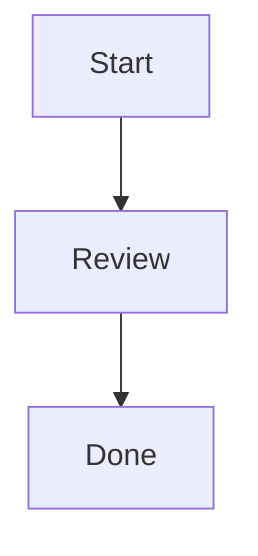

# Mermaid concept views

Research record for issue #186. This record is evidence, not a change to OKF
concepts, skills, runtime behavior, or test policy. "Observed" statements are
supported by the linked primary sources. "Recommendation" statements need a
recorded product decision before implementation.

## Observed

- GitHub renders Mermaid fenced blocks in Issues, Discussions, pull requests,
  wikis, and Markdown files. Its required Markdown form is a fenced block with
  the `mermaid` language identifier. GitHub also says to use an `info` diagram
  to inspect the Mermaid version that the host currently uses. [GitHub: creating
  diagrams](https://docs.github.com/en/get-started/writing-on-github/working-with-advanced-formatting/creating-diagrams)
- This repository reads concept bodies with native file and search tools and
  requires an untouched Markdown body to remain byte-identical after a write.
  It defines the shared skill source as `SKILL.md` plus referenced files and
  scripts, without claiming identical harness behavior.
  [Repository spec: native reading](https://github.com/artemVeduta/okf-agent-skills/blob/43fff4299539b9c3f6de85376ef8412eb3622f4e/docs/spec/okf-agent-skills-v0.1.0.md#L55-L56)
  [Repository spec: body preservation](https://github.com/artemVeduta/okf-agent-skills/blob/43fff4299539b9c3f6de85376ef8412eb3622f4e/docs/spec/okf-agent-skills-v0.1.0.md#L695-L708)
  [Repository spec: shared source](https://github.com/artemVeduta/okf-agent-skills/blob/43fff4299539b9c3f6de85376ef8412eb3622f4e/docs/spec/okf-agent-skills-v0.1.0.md#L2819-L2824)
- Claude Code, Codex, and OpenCode each define a skill as a `SKILL.md` file
  whose Markdown instructions are loaded for an agent. None of these sources
  establishes Mermaid rendering as part of skill loading.
  [Claude Code skills](https://code.claude.com/docs/en/skills)
  [Codex build skills](https://developers.openai.com/codex/build-skills/)
  [OpenCode agent skills](https://opencode.ai/docs/skills/)
- Mermaid definitions start with a diagram declaration. Mermaid documents
  `graph` as an alias for `flowchart`, directions including `TD`, node text,
  and arrow links. It also documents syntax breakers: lowercase `end`, and
  `---o` or `---x` immediately before a target node.
  [Mermaid syntax reference](https://mermaid.js.org/intro/syntax-reference.html)
  [Mermaid flowcharts](https://mermaid.js.org/syntax/flowchart.html)
- Mermaid offers `mermaid.parse()` for syntax validation, but its official
  usage document installs Mermaid as an npm dependency. The separate official
  CLI is also an npm package and renders SVG, PNG, or PDF. Neither is a
  zero-dependency repository check.
  [Mermaid usage](https://mermaid.js.org/config/usage.html)
  [Mermaid CLI](https://github.com/mermaid-js/mermaid-cli)
- The repository gate uses `node --test` with only the standard library and
  has one runtime contract seam: a wrapper script run as a process. Static
  skill-file checks are permitted but do not create a runtime contract.
  [Repository completion spec: testing decisions](https://github.com/artemVeduta/okf-agent-skills/blob/43fff4299539b9c3f6de85376ef8412eb3622f4e/docs/spec/okf-agent-skills-v0.1.0-completion.md#L438-L469)

## Recommendation

Use this source-readable profile when a concept needs a view:

````markdown

````

- Use one `graph TD` declaration, one ASCII uppercase identifier per node,
  short ASCII labels in square brackets, and one `-->` edge per line.
- Do not use frontmatter or directives, styles, classes, themes, subgraphs,
  interactive links or callbacks, external images or icons, Markdown-in-labels,
  quoted or Unicode labels, or version-specific shapes and arrows.
- Do not use `end` as a label. Do not begin a target directly after `---` with
  lowercase `o` or `x`.
- Keep the prose, rules, and relationships understandable without a renderer.
  A diagram is a view, not the only statement of durable meaning.

This is deliberately narrower than the current Mermaid language. It is based
on GitHub's documented `graph TD` example and Mermaid's documented basic
flowchart syntax, not on a claim that every Mermaid host uses one version.
[GitHub: creating diagrams](https://docs.github.com/en/get-started/writing-on-github/working-with-advanced-formatting/creating-diagrams)
[Mermaid flowcharts](https://mermaid.js.org/syntax/flowchart.html)

## Rendering boundary

**Observed:** GitHub rendering is available for a valid `mermaid` fenced block
on its listed Markdown surfaces. GitHub controls the Mermaid version, so a
repository cannot require a pinned parser version, identical SVG layout,
theme, font, or interactive behavior. The three supported skill systems have
no documented Mermaid-rendering contract. [GitHub: creating
diagrams](https://docs.github.com/en/get-started/writing-on-github/working-with-advanced-formatting/creating-diagrams)
[Claude Code skills](https://code.claude.com/docs/en/skills)
[Codex build skills](https://developers.openai.com/codex/build-skills/)
[OpenCode agent skills](https://opencode.ai/docs/skills/)

**Recommendation:** Require source readability everywhere. Treat a GitHub
render as a current hosted presentation only. Do not make rendering, visual
appearance, or a live harness process a release requirement.

## Zero-dependency validation

| Option | Deterministic result | Limit |
| --- | --- | --- |
| Read the fenced source against the profile | Human review of source readability | Not automated; proves no Mermaid parse or render result. |
| `git diff --check` | Detects changed-file whitespace errors and conflict markers | Does not identify a Mermaid fence, parse Mermaid, or render a diagram. [Git `--check`](https://git-scm.com/docs/git-diff#Documentation/git-diff.txt---check) |
| A future Node standard-library static profile check | Can deterministically check fence pairing, `mermaid` info string, `graph TD`, and the selected node and edge forms | Validates only this repository profile. It cannot prove Mermaid parsing, GitHub acceptance, or rendered appearance. It needs a recorded decision before addition. |
| Mermaid `parse()` or Mermaid CLI | Can validate Mermaid syntax; the CLI can render output | Requires Mermaid or its CLI, so it cannot meet the current zero-dependency gate. [Mermaid usage](https://mermaid.js.org/config/usage.html) [Mermaid CLI](https://github.com/mermaid-js/mermaid-cli) |
| GitHub preview or API rendering | Can observe GitHub's current host behavior | Requires network and a changing hosted renderer, so it is not a deterministic repository test. [GitHub: creating diagrams](https://docs.github.com/en/get-started/writing-on-github/working-with-advanced-formatting/creating-diagrams) |

## Decision-ready result

- **Smallest portable subset:** a `mermaid` fenced block containing only the
  recommended `graph TD` flowchart profile above. Its source remains useful in
  concept bodies and skill files when no renderer exists.
- **Required rendering:** GitHub may render the profile in its documented
  Markdown surfaces. No render, fixed Mermaid version, SVG appearance, or
  interactive behavior may be required from concept readers or the supported
  harnesses.
- **Zero-dependency validation:** require source review and `git diff --check`.
  If automated profile enforcement becomes necessary, add only a
  standard-library static checker after a recorded decision. Do not add Mermaid
  parsing, CLI rendering, or a live-host check to the deterministic gate.

## Unresolved facts

- GitHub's documented `info` diagram can show its current Mermaid version, but
  this research found no repository-pinned GitHub Mermaid version or visual
  compatibility commitment.
- The product decision whether a concept view needs automated profile checking
  is still open. This record does not create that check or define a new concept
  field or body convention.
