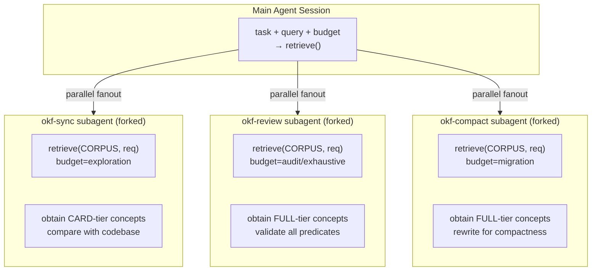
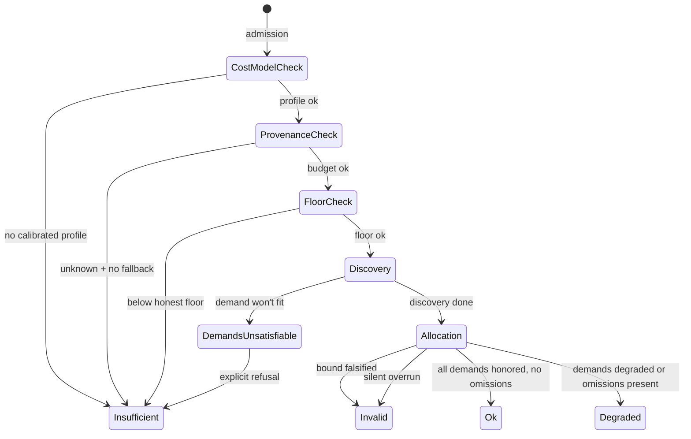

# Issue #13 — Agent Retrieval Runtime: End-to-End Flow

## Overview

Issue [#13](https://github.com/artemVeduta/okf-agent-skills/issues/13) designs the **stateless shared retrieval runtime** that the OKF skill suite uses to load relevant concepts into the agent's context window while staying within a token budget.

```
┌─────────────────────────────────────────────────────────────────────┐
│                     HARNESS (Claude Code / Codex / OpenCode)         │
│                                                                     │
│  ┌─────────────┐    ┌──────────────────┐    ┌─────────────────────┐ │
│  │  okf-sync    │    │   okf-review     │    │  okf-compact        │ │
│  │  (skill)     │    │   (skill)        │    │  (skill)            │ │
│  └──────┬───────┘    └───────┬──────────┘    └────────┬────────────┘ │
│         │                    │                         │              │
│         └────────────────────┼─────────────────────────┘              │
│                              │                                        │
│                     ┌────────▼────────┐                               │
│                     │  RETRIEVAL      │                               │
│                     │  RUNTIME        │ ◄── shared across all skills  │
│                     │  (pure function)│                                │
│                     └────────┬────────┘                               │
│                              │                                        │
│         ┌────────────────────┼────────────────────┐                   │
│         │                    │                    │                   │
│    ┌────▼─────┐        ┌────▼─────┐        ┌─────▼────┐              │
│    │ CORPUS    │        │  COST    │        │  QUERY   │              │
│    │ (injected)│        │  MODEL   │        │  ENGINE  │              │
│    └───────────┘        └──────────┘        └──────────┘              │
│                                                                     │
│  ┌───────────────────────────────────────────────────────────────┐  │
│  │  OUTPUT: entries[], omissions{}, receipt{}, budget{}           │  │
│  │  outcome ∈ {ok, degraded, insufficient, invalid}               │  │
│  └───────────────────────────────────────────────────────────────┘  │
└─────────────────────────────────────────────────────────────────────┘
```

## The Subagent Architecture

A single agent session delegates OKF-related work to **specialised subagents**. Each subagent invokes the shared retrieval runtime, reading and writing documents through the skill suite.



## The 12-Phase Retrieval Pipeline

```
                              ┌─────────┐
                              │  START  │
                              └────┬────┘
                                   │
                    ┌──────────────▼──────────────┐
                    │  1. Cost Model Admission     │
                    │  calibrated profile?         │
                    │  no → insufficient           │
                    └──────────────┬──────────────┘
                                   │
                    ┌──────────────▼──────────────┐
                    │  2. Allowance & Provenance   │
                    │  explicit/estimated/unknown  │
                    │  unknown + no fallback       │
                    │  → insufficient              │
                    └──────────────┬──────────────┘
                                   │
                    ┌──────────────▼──────────────┐
                    │  3. Reserve Carving          │
                    │  task-kinded fraction        │
                    │  + declared output req       │
                    │  spendable = allowance-reserve│
                    └──────────────┬──────────────┘
                                   │
                    ┌──────────────▼──────────────┐
                    │  4. Honest Retrieval Floor   │
                    │  receipt + notice + demands  │
                    │  below floor → insufficient  │
                    └──────────────┬──────────────┘
                                   │
                    ┌──────────────▼──────────────┐
                    │  5. DISCOVERY                │
                    │  inventory → index →         │
                    │  frontmatter → body          │
                    │  (satisficing or exhaustive) │
                    └──────────────┬──────────────┘
                                   │
                    ┌──────────────▼──────────────┐
                    │  6. Exact Demands            │
                    │  resolved before ranking     │
                    │  refused if they don't fit   │
                    └──────────────┬──────────────┘
                                   │
                    ┌──────────────▼──────────────┐
                    │  7. Evidence-Bound Filters   │
                    │  active? seen? rejected?     │
                    │  FILTERED dominates CLIPPED  │
                    └──────────────┬──────────────┘
                                   │
                    ┌──────────────▼──────────────┐
                    │  8. Ranking                  │
                    │  query clauses vs searchText │
                    │  strong/medium/weak scores   │
                    └──────────────┬──────────────┘
                                   │
                    ┌──────────────▼──────────────┐
                    │  9. Tier Allocation          │
                    │  9a. Demands (FULL→LINE)     │
                    │  9b. Ranked fill (best-fit)  │
                    │  LINE > CARD > SECTION > FULL│
                    └──────────────┬──────────────┘
                                   │
                    ┌──────────────▼──────────────┐
                    │  10. Omission Structure      │
                    │  named/counted/collapsed     │
                    │  CLIPPED, FILTERED, MISS,    │
                    │  UNDISCOVERED, UNSEARCHED    │
                    └──────────────┬──────────────┘
                                   │
                    ┌──────────────▼──────────────┐
                    │  11. Receipt                 │
                    │  12+ fields, per-line costs  │
                    │  seam-aware reservation      │
                    └──────────────┬──────────────┘
                                   │
                    ┌──────────────▼──────────────┐
                    │  12. Audit                   │
                    │  boundStatus: verified/      │
                    │  unverified                  │
                    │  falsified → invalid         │
                    └──────────────┬──────────────┘
                                   │
                            ┌──────▼──────┐
                            │  RESULT     │
                            └─────────────┘
```

## Real Example: Feature Development on a Code-Backed Project

### Setup

```
Project:  payment-service  (code-backed project)
Bundle:   .okf/
          ├── concepts/
          │   ├── retention-policy.md
          │   ├── ledger.md
          │   ├── onboarding.md
          │   └── trust-tier.md
          └── index.md

Task:     feature-build  → reserve profile: 0.35 × allowance (min 360)
Allowance: 2500 tokens   → reserve = max(360, 875 + 0) = 875
                         → spendable = 2500 - 875 = 1625
```

### The Request

```typescript
const req = {
  query: "how long is the retention window for transaction ledgers",
  exact:  ["ledger"],                  // must be included, respects bypass warning
  task:   "feature",
  declaration: {
    deployment:          "payment-service/v1",
    seam:                "in-context",    // CLI output enters model context
    allowance:           2500,
    provenance:          "explicit",
    costModelId:         "CONSERVATIVE",
    auditCapable:        true,
    declaredOutputReserve: 0,
  },
  filters: {
    includeDeprecated: false,
    includeDraft:      false,
  },
};
```

### Step-by-Step Walkthrough

```
PHASE 1-2: ADMISSION
  ✓ cost model "CONSERVATIVE" is calibrated
  ✓ provenance is explicit
  allowance = 2500

PHASE 3: RESERVE
  task "feature" → reserveProfile fraction 0.35, minimum 360
  reserve = max(360, ceil(0.35×2500) + 0) = 875
  spendable = 1625

PHASE 4: HONEST FLOOR
  floor = receipt(40) + notice(14) + collapsed(10) + 1×perName(9) = 73
  1625 > 73  ✓

PHASE 5: DISCOVERY (in-context seam, satisficing)
  [buy] inventory  → costs 6 context tokens, 1 file work
    now observed: locator for all 4 concepts
  [buy] index      → costs 4 context, reveals titles
  [buy] frontmatter→ costs 16 context, reveals card (status, type, tags)
    now observed: card for all 4 concepts
  [buy] body       → reads bodies, finds sections matching query
    evidence rule satisfied? check...

PHASE 6: EXACT DEMANDS
  "ledger" resolves to concept ledger (id match)
  [resolved: { ledger }]
  [unresolved: none]

PHASE 7: FILTERS
  predicates active: [status=deprecated, status=draft]
  scanning 4 concepts at card level...
    • retention-policy → status=active  → pass
    • ledger           → status=active  → pass
    • onboarding       → status=deprecated → FILTERED!
    • trust-tier       → status=active  → pass

PHASE 8: RANKING
  Query: "how long is the retention window for transaction ledgers"
  Clauses: [how, long, retention, window, transaction, ledgers]

  retention-policy (score 26):
    • id:          "retention"          ↔ retention   (+2)
    • path:        "retention-policy"   ↔ retention   (+2)
    • title:       "Retention Policy"   ↔ retention   (+4)
    • description: "Controls data retention..." ↔ retention (+3)
    • tags:        [retention, policy]               (+6)
    • sections:    2 matched (ledger text)           (+6)
    → score: 26 → asks: FULL

  ledger (score 22) [DEMANDED]:
    • id:          "ledger"             ↔ ledgers     (+2)
    • title:       "Transaction Ledger" ↔ ledgers     (+4)
    • description: "Each transaction..." ↔ ledgers    (+3)
    • tags:        [ledger, data]       ↔ ledgers     (+3)
    • sections:    1 matched                (+6)
    → score: 22 → demand, asks: FULL

  trust-tier (score 6):
    • title:       "Trust Tier"         → no match    (0)
    • description: "Advisory classification..."→ no match (0)
    • tags:        [trust, tier]        → no match    (0)
    • sections:    0 matched                           (0)
    → score: 0 → MISS (all channels examined, nothing matched)

  onboarding: FILTERED (deprecated) → skip ranking
  ledger: already DEMANDED → skip ranking

PHASE 9: ALLOCATION (1625 spendable - 200 already spent = 1425 remaining)

  9a. DEMANDS FIRST:
    ledger wants FULL. Full cost = card + body = 42.
      1425 - 42 - omissionReserve(20) - receiptReserve(125) = 1238 ✓
    → DEMANDED at FULL tier
    → context charge: +42, work charge: +1 file

  9b. RANKED FILL:
    retention-policy wants FULL (score 26 > strong=6).
    FULL cost = 85.
      1238 - 85 - omissionReserve(19) - receiptReserve(130) = 1004 ✓
    → SELECTED at FULL tier
    → context charge: +85

    trust-tier score 0 → MISS (already recorded)

PHASE 10: OMISSIONS
  Named:
    CLIPPED:  []     (none: everything fit)
    FILTERED: [onboarding]  (deprecated)
    MISS:     [trust-tier]
    BYPASS:   []     (no filter bypass demanded)

  form → "named" (under nameCap of 3, under noticeShareCap 25%)

PHASE 11: RECEIPT
  scopeSnapshot: "payment-service@4"
  seam: "in-context"
  stopReason: "satisficing: the evidence rule was satisfied"
  selected: [{id:"ledger", tier:"FULL"}, {id:"retention-policy", tier:"FULL"}]
  contextLines:
    DISCOVERY inventory:payment-service   bound=6  charged=6  observed=5
    DISCOVERY index:.okf/concepts         bound=4  charged=4  observed=4
    DISCOVERY frontmatter:.okf/concepts   bound=16 charged=16 observed=14
    DISCOVERY body:.okf/concepts          bound=35 charged=35 observed=32
    DEMAND     ledger@FULL                bound=42 charged=42 observed=38
    RANKED     retention-policy@FULL      bound=85 charged=85 observed=75
    NOTICE     omissions                  bound=26 charged=26 observed=24
    RECEIPT    receipt                    bound=82 charged=82 observed=78
  total context spent: 296 / 1625 spendable

PHASE 12: AUDIT
  auditCapable: true → comparing observed vs bound
  no line exceeds its bound → boundStatus: "verified"
  no violations

RESULT: outcome=ok,  2 selected,  1 filtered,  1 miss
```

## Outcome Classes Diagram



## The Two-Ledger Design

```
╔═══════════════════════════════════════════════════════════════════════╗
║                          THE TWO LEDGERS                              ║
╠═════════════════════════════╦═════════════════════════════════════════╣
║  CONTEXT LEDGER             ║  WORK LEDGER                           ║
║  (what the model sees)      ║  (what the runtime does)               ║
╠═════════════════════════════╬═════════════════════════════════════════╣
║                             ║                                        ║
║  discovery output           ║  filesInspected                        ║
║  materialized concepts      ║  bytesParsed                           ║
║  omission notice            ║  probeOutputBytes                      ║
║  receipt                    ║  ticks (execution time)                ║
║                             ║                                        ║
║  has ONE rule:              ║  has FOUR dimensions:                  ║
║  charges bytes entering     ║  no scalar total — each is its own     ║
║  model context              ║  ceiling                               ║
║                             ║                                        ║
╠═════════════════════════════╬═════════════════════════════════════════╣
║                             ║                                        ║
║  on the IN-CONTEXT seam:    ║  on the OUT-OF-CONTEXT seam:           ║
║  discovery output is charged║  discovery stays on the work ledger    ║
║  to BOTH ledgers            ║  only materialization hits context     ║
║                             ║                                        ║
╚═════════════════════════════╩═════════════════════════════════════════╝
```

## The Five Verdict Classes & Their Remedies

```
VERDICT         CAUSE                         FIX
────────        ─────                         ───
SELECTED        scored, fit, admitted         happy path
DEMANDED        exact demand, honored         (demand baseline)

CLIPPED         context allowance ended       raise allowance or name as exact demand
FILTERED        policy rejection (deprecated) turn off that filter
MISS            all channels examined,        change the query
                nothing matched

UNDISCOVERED    work envelope ended           raise the work envelope
                OR context allowance ended    OR raise the context allowance
                (carries `ledger` field
                 to distinguish)

UNSEARCHED      evidence rule already         switch breadth to exhaustive
                satisfied (satisficing)       OR raise the work envelope

UNRESOLVED      exact demand had no match     check the reference
```

## Subagent Workflow: The Real Orchestration

The retrieval runtime is a **pure function** — stateless, deterministic, no I/O. The subagent is the **orchestrator** that:

1. Constructs the request from current session context
2. Calls `retrieve(corpus, request)` (or its equivalent skill invocation)
3. Reads the result receipt to decide next steps
4. Materialises the selected concepts into the agent's context
5. Takes action (validate, sync, compact, review)

```
┌─────────────────────────────────────────────────────────────────────┐
│                    SUBAGENT LIFECYCLE                               │
│                                                                     │
│  ┌───────────┐    ┌───────────┐    ┌───────────┐    ┌───────────┐ │
│  │ CONSTRUCT  │───▶│ RETRIEVE  │───▶│ EVALUATE  │───▶│   ACT     │ │
│  │ request    │    │ corpus    │    │ receipt   │    │ (write,   │ │
│  │ from       │    │ + budget  │    │ + entries │    │  validate │ │
│  │ harness    │    │           │    │           │    │  sync...) │ │
│  └───────────┘    └───────────┘    └───────────┘    └───────────┘ │
│                                                                     │
│  CONSTRUCT:                                                         │
│    • read task kind from harness (exploration/feature/debugging/...)│
│    • extract query from session context (what work is being done)   │
│    • declare exact demands (paths the subagent must see)            │
│    • attest seam property (in-context if CLI, out if library)       │
│    • set audit capability (can we get exact post-emission count?)   │
│                                                                     │
│  RETRIEVE:                                                          │
│    • pure function over injected corpus                             │
│    • 12-phase pipeline                                              │
│    • returns entries[], omissions{}, receipt{}, budget{}            │
│    • outcome ∈ {ok, degraded, insufficient, invalid}                 │
│                                                                     │
│  EVALUATE:                                                          │
│    • receipt.selected → which concepts at which tiers               │
│    • receipt.contextLines → where the budget went                   │
│    • omissions.unevaluatedPredicates → blind spots to warn about    │
│    • entry.nextAction → concrete steps to unblock unresolved work   │
│                                                                     │
│  ACT:                                                               │
│    • materialise selected concepts into agent context               │
│    • execute the skill's purpose (write, validate, compare...)      │
│    • emit an evidence record (what was done, observed sizes)        │
└─────────────────────────────────────────────────────────────────────┘
```

## The Fixture Reality

The prototype runs against two **injected corpora** — tiny, hand-crafted bundles that exercise every branch:

```
CORPUS 0: knowledge-bundle  ("knowledge-only project")
  concepts:  [retention, ledger, onboarding, trust-tier, concept-selection,
              legacy-retention, sectionless-guide, ghost, orphan]
  indexes:   [.okf/concepts → withDescriptions: true]
  key:       "knowledge-bundle@9"

CORPUS 1: code-bundle  ("code-backed project")
  (identical in every concept the query selects, differs 10× in unselected bytes)
  used for the seam experiment (C1-C3)
```

And the prototype's **catalogue** proves the decision procedure is internally consistent:
- **102 cases** driven by TUI key sequences (reproducible by hand)
- **136,080-run sweep** varying allowance continuously (not just 7 steps)
- Every invariant holds: no silent overruns, monotonicity in allowance, atomic tier allocation, no duplicate verdicts

## Key Design Resolutions from #13

| Question | Resolution |
|----------|------------|
| How is the budget obtained? | Provenance declaration: explicit (harness attests it), estimated (degraded), unknown (insufficient unless fallback exists) |
| Default retrieval breadth? | Task-kinded: audits/migrations/reviews are exhaustive; everything else satisficing |
| Progressive disclosure? | Four-tier ladder: LINE → CARD → SECTION → FULL. Atomic (concept+tier) allocation. SECTION carries complete manifest to avoid invisible loss |
| Which retrieval modes? | Boolean AND (clause coverage) with optional df-weighted informativeness. No stemming, no synonyms, no stopword deletion, no substring matching |
| `importance` field? | No. Informativeness is document-frequency-derived, corpus-local, purely lexical |
| Standalone skill or shared runtime? | Shared pure function invoked by all skills. Harness-specific adapter attests the seam, budget provenance, and audit capability |
| SECTION honesty? | SECTION = CARD + section manifest + selected sections. Without this, truncated content looks like full content |
| Receipt reservation? | Must be reserved for (finding 1). Size depends on selection it reports — same largest-reachable rule as the notice |

## Verdict Ladder Summary

```
Evidence through inventory (locator) ──▶ scoring impossible
Evidence through index (title)       ──▶ basic scoring
Evidence through frontmatter (card)  ──▶ tags + type scoring, filter predicate evaluation
Evidence through body (probed)       ──▶ section scoring, FULL/SECTION tier allocation

Query has no clauses + no demands    ──▶ its own named state (not confident `ok`)
```

---

*Generated from the prototype at `prototypes/retrieval-runtime/` on branch `prototype/retrieval-runtime`.*
*Contracts: `retrieve.ts` / `driver.ts` / `corpus.ts` / `query.ts` / `cost.ts` — 1,400+ lines of executable contract.*
*Sweep: 102 catalogue cases + 136,080-run continuous allowance sweep — all green.*
